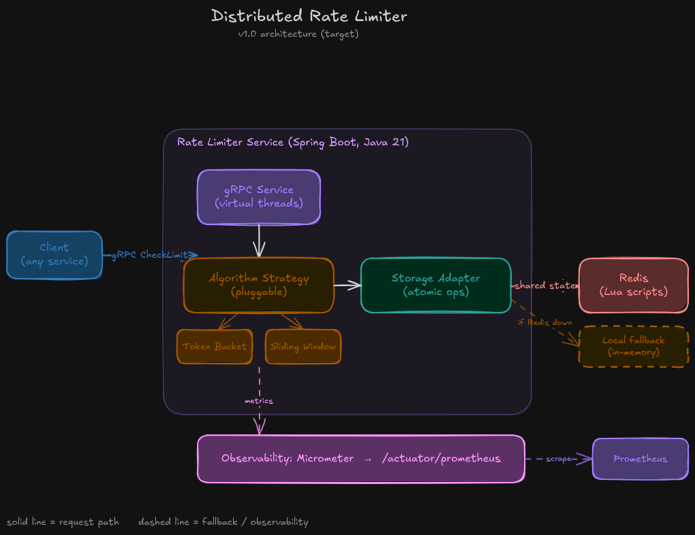

# Architecture (evolving)

> This document describes the *intended* architecture. The current implementation lags this design. See README for what's actually built.

## High-level

## Components (planned)

- **gRPC service layer** — accepts `CheckLimit` requests, routes to active algorithm
- **Algorithm strategy** — pluggable; v0.1 ships token bucket (default), v1.0 adds sliding-window log. Selectable via `rate-limiter.algorithm=token-bucket|sliding-window`.
- **Storage layer** — Redis for shared state across instances. Atomic operations via Lua scripts.
- **Observability** — Micrometer → Prometheus. Histograms for latency, counters for allow/deny.

### Sliding-window (v1.0)

- **`SlidingWindowImplementation`** — `@ConditionalOnProperty(name = "rate-limiter.algorithm", havingValue = "sliding-window")`. Reads `windowSizeInSeconds` / `maxRequests` from `SlidingWindowConfigurationProperties`.
- **Sliding window log** — uses a `TreeMap<Long, Long>` (timestamp → count) in the in-memory store, and a Redis Sorted Set (score=timestamp, member=unique ID) via `lua/sliding_window.lua`.
- **Weighted tokens** — each request consumes `tokens` positions in the window (duplicate timestamps merged via count).
- **Retry-after** — computed from the oldest request in the current window: `oldestTimestampMs + windowSizeMs - nowMs`.
- **Storage profile** — `InMemorySlidingWindowStateStore` (`@Profile("!redis")`) and `RedisSlidingWindowStateStore` (`@Profile("redis")`), analogous to the token bucket's two storage implementations.

## Open questions (TBD by version)

- [ ] Fail-open vs fail-closed when Redis is unreachable? — *decision in v0.5*
- [ ] Consistent hashing vs centralised counters? — *decision in v1.0*
- [ ] How are rate-limit rules configured? Static YAML vs dynamic API? — *defer past v1.0*